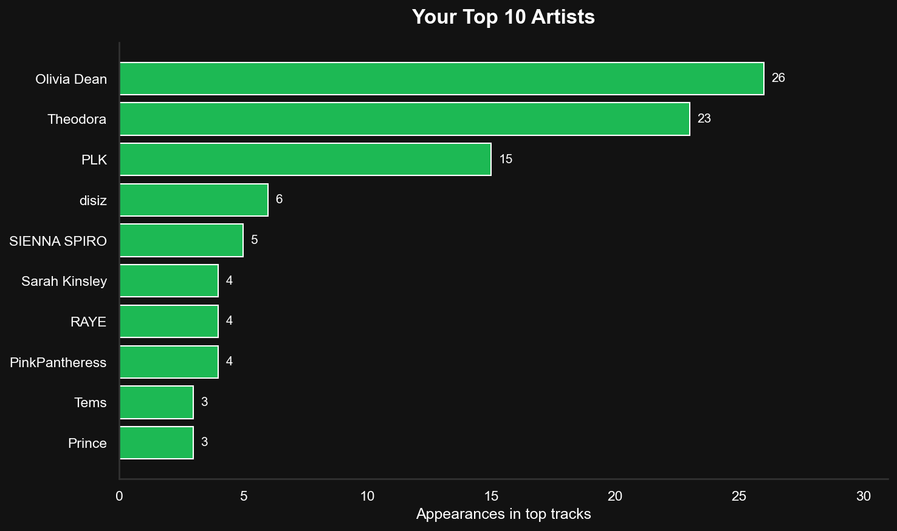
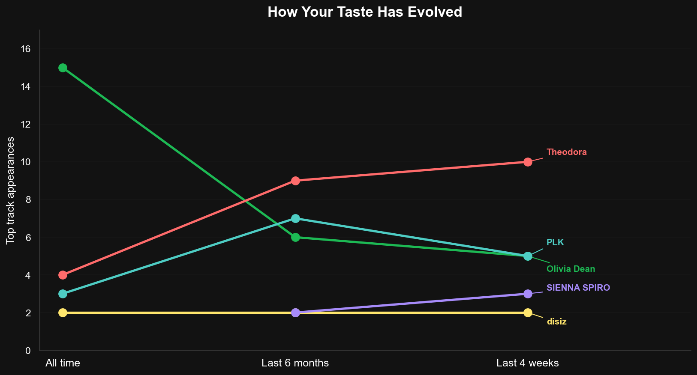
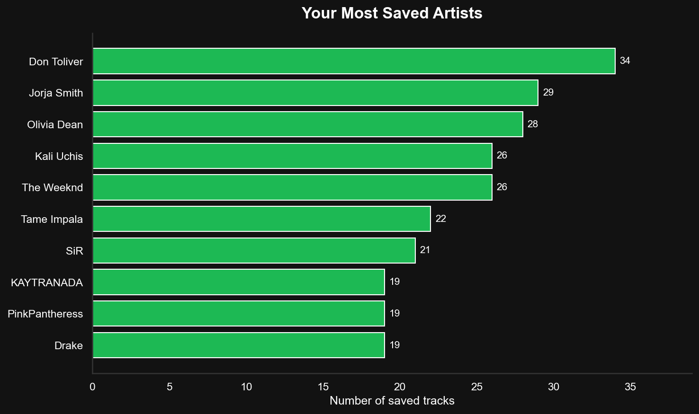
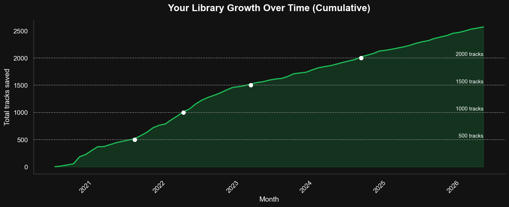
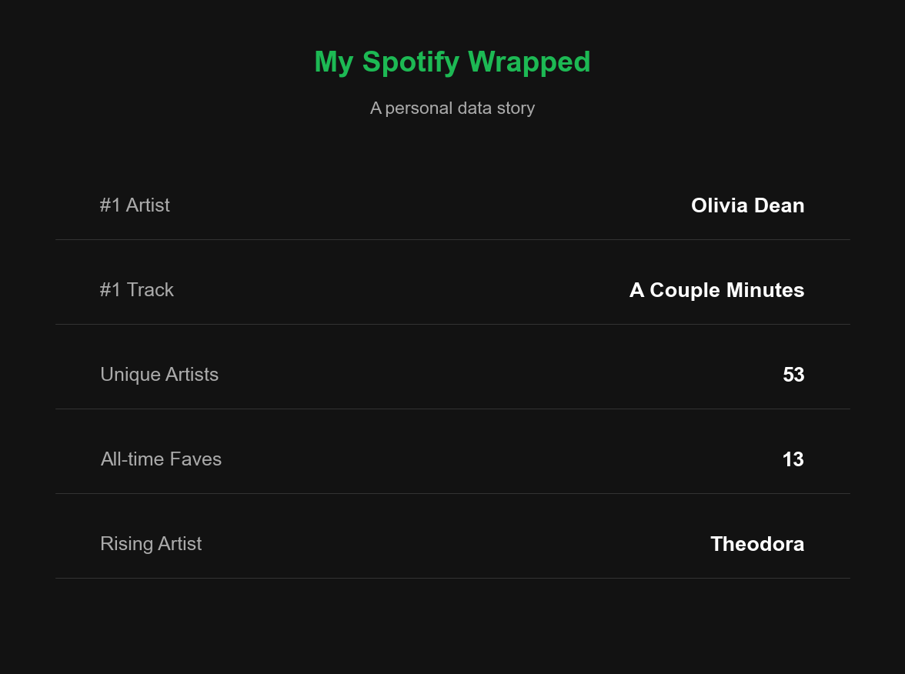

# 🎵 My Spotify Wrapped — A Personal Music Analysis

A self-built alternative to Spotify Wrapped using the Spotify Web API and Python.

## What this project does
- Authenticates with the Spotify API using OAuth 2.0
- Pulls personal top tracks across 3 time ranges (last 4 weeks, 6 months, all time)
- Fetches full saved library of 2,571 tracks across 1,014 artists
- Analyses listening patterns and taste evolution over time
- Visualises findings with a Spotify-inspired dark theme

## Tech stack
- Python, Jupyter Notebook
- Spotipy (Spotify API wrapper)
- Pandas, Matplotlib, Seaborn

## Key findings
- Olivia Dean is my all-time #1 artist
- Theodora is my fastest rising artist in recent weeks
- PLK is my most consistent long-term favourite
- My library has grown steadily since 2020 reaching 2,571 saved tracks

## Charts

## Setup
1. Create a Spotify Developer app at developer.spotify.com
2. Replace `YOUR_CLIENT_ID` and `YOUR_CLIENT_SECRET` in the notebook
3. Set redirect URI to `http://127.0.0.1:8080/callback`
4. Install dependencies: `pip install spotipy pandas matplotlib seaborn`
5. Run all cells top to bottom